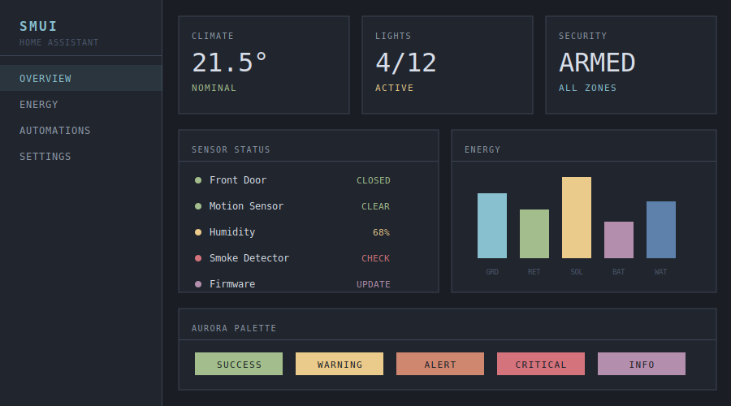
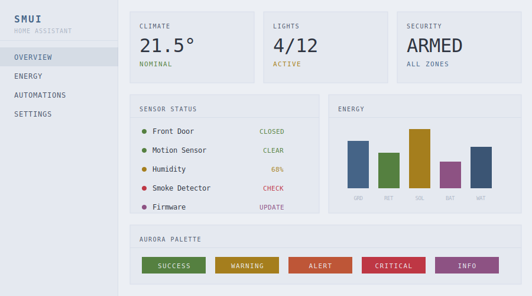

# SMUI Theme for Home Assistant

A terminal-aesthetic Home Assistant theme inspired by [SMUI](https://smui.statico.io/) (SpaceMolt UI). Built on the [Nord color palette](https://www.nordtheme.com/) with a starship bridge terminal aesthetic.

### Dark Mode


### Light Mode


## Design Philosophy

- **Terminal-grade readability** -- High-contrast text on dark surfaces
- **Utilitarian precision** -- No border radius, no shadows, no gradients. Hard edges and clear boundaries.
- **Status at a glance** -- Nord's aurora palette for system states: green for success, yellow for warning, orange for alert, red for critical, purple for info

## Features

- Full dark and light mode support
- Nord color palette throughout
- Sharp corners on all cards and elements (0px border radius)
- No box shadows -- depth via surface color hierarchy
- Complete coverage: cards, sidebar, header, inputs, switches, sliders, energy dashboard, climate, alarms, and more

## Installation

### HACS (Recommended)

1. Make sure [HACS](https://hacs.xyz/) is installed in your Home Assistant instance
2. Go to **HACS** > **Frontend**
3. Click the three dots menu (top right) > **Custom repositories**
4. Add `https://github.com/statico/smui-homeassistant` with category **Theme**
5. Search for "SMUI" and install it
6. Restart Home Assistant

### Manual Installation

1. Download `themes/smui.yaml` from this repository
2. Copy it into your Home Assistant `themes/` directory
3. Make sure your `configuration.yaml` includes:

```yaml
frontend:
  themes: !include_dir_merge_named themes
```

4. Restart Home Assistant

## Activation

1. Go to your **User Profile** (click your avatar in the sidebar)
2. Under **Theme**, select **SMUI**
3. Choose your preferred mode (dark or light) under **Dark mode**

## Color Palette

Based on [Nord](https://www.nordtheme.com/):

| Role | Dark | Light |
|------|------|-------|
| Background | `#1a1e24` | `#eceff4` |
| Surface | `#21262e` | `#e5e9f0` |
| Primary | `#88c0d0` | `#456487` |
| Text | `#d8dee9` | `#2e3440` |
| Border | `#3b4252` | `#d8dee9` |
| Success | `#a3be8c` | `#558040` |
| Warning | `#ebcb8b` | `#a57e1d` |
| Error | `#d4737c` | `#be3744` |
| Info | `#b48ead` | `#8d5283` |

## Credits

- [SMUI](https://smui.statico.io/) by [statico](https://github.com/statico)
- [Nord](https://www.nordtheme.com/) color palette
- Inspired by the bridge terminals of starships in science fiction

## License

MIT
